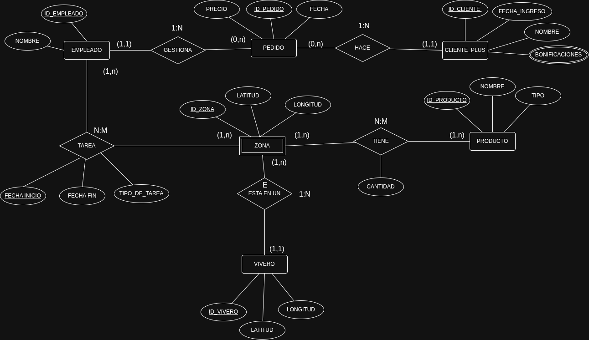

# PR2_AdminBBDD_Leandro_Kyliam

# Modelo entidad/relación: Viveros Tajinaste S.A.

# Descripción del modelo

## Entidades

**Vivero.** Cada uno de los viveros de la red de Tajinaste S.A. Se identifica por un código propio y se guarda su georreferenciación (latitud y longitud).

**Zona.** Cada una de las áreas en las que se divide un vivero (zona exterior, almacén, invernadero...), en las que se almacenan los productos, trabajan los empleados y desde las que se sirven los pedidos. Tiene su propia georreferenciación. Es una **entidad débil con dependencia en existencia** respecto a Vivero: aunque tiene un identificador propio.

**Producto.** Cada uno de las referencias que vende la empresa: plantas, productos de jardinería y artículos de decoración.

**Empleado.** Cada una de las personas que trabajan en la empresa, que son destinadas a las zonas de los viveros y que gestionan los pedidos.

**Pedido.** Cada uno de los pedidos realizados por los clientes. Se modela como entidad porque tiene identidad propia (un número de pedido) y datos propios, y porque se relaciona de forma independiente con el empleado responsable, el cliente, los productos que contiene y la zona desde la que se sirve.

**Cliente.** Cada uno de los clientes de la empresa, pertenezcan o no al programa de fidelización. Es la entidad general de una jerarquía con dos subtipos:

- **Básico.** Clientes que no pertenecen al programa Tajinaste Plus. No tienen atributos propios, pero se registran sus pedidos para conocer las ventas y la salida de productos.
- **Plus.** Clientes que pertenecen al programa Tajinaste Plus. Tienen una fecha de ingreso en el programa y reciben bonificaciones mensuales.

## Atributos y dominios

### Vivero

| Atributo | Tipo | Descripción | Dominio | Ejemplos |
|---|---|---|---|---|
| `id_vivero` | Identificador | Código único del vivero | Número entero positivo | 1, 2, 15 |
| `latitud` | Descriptor | Latitud de la ubicación del vivero | Número decimal entre -90 y 90 | 28.4874 |
| `longitud` | Descriptor | Longitud de la ubicación del vivero | Número decimal entre -180 y 180 | -16.3159 |

### Zona

| Atributo | Tipo | Descripción | Dominio | Ejemplos |
|---|---|---|---|---|
| `id_zona` | Identificador | Código único de la zona | Número entero positivo | 1, 7, 42 |
| `latitud` | Descriptor | Latitud de la zona dentro del vivero | Número decimal entre -90 y 90 | 28.4876 |
| `longitud` | Descriptor | Longitud de la zona dentro del vivero | Número decimal entre -180 y 180 | -16.3161 |

### Producto

| Atributo | Tipo | Descripción | Dominio | Ejemplos |
|---|---|---|---|---|
| `id_producto` | Identificador | Código único del producto | Número entero positivo | 1, 230, 1504 |
| `nombre` | Descriptor | Nombre comercial del producto | Texto | "Rosal trepador", "Saco de sustrato 50 L", "Maceta de barro" |
| `tipo` | Descriptor | Categoría del producto | {planta, jardinería, decoración} | "planta", "decoración" |
| `precio` | Descriptor | Precio de venta por unidad, en euros | Número decimal mayor que 0, con dos decimales | 12.95, 4.50 |

### Empleado

| Atributo | Tipo | Descripción | Dominio | Ejemplos |
|---|---|---|---|---|
| `id_empleado` | Identificador | Código único del empleado | Número entero positivo | 1, 23, 108 |
| `nombre` | Descriptor | Nombre y apellidos del empleado | Texto | "Ana Pérez González" |
| `productividad` | Derivado | Medida de la actividad del empleado, calculada a partir de los pedidos que gestiona y de sus destinos | Número decimal mayor o igual que 0 | 1450.75 (euros vendidos en un periodo) |

### Pedido

| Atributo | Tipo | Descripción | Dominio | Ejemplos |
|---|---|---|---|---|
| `id_pedido` | Identificador | Número único del pedido | Número entero positivo | 1532, 1533 |
| `fecha` | Descriptor | Fecha en la que se realizó el pedido | Fecha (AAAA-MM-DD) | 2026-03-15 |

El importe total de un pedido no se guarda como atributo, ya que se obtiene a partir de los productos que contiene, sus cantidades y su precio.

### Cliente

| Atributo | Tipo | Descripción | Dominio | Ejemplos |
|---|---|---|---|---|
| `id_cliente` | Identificador | Código único del cliente | Número entero positivo | 1, 87, 2301 |
| `nombre` | Descriptor | Nombre y apellidos del cliente | Texto | "Luis Martín Díaz" |

### Plus

| Atributo | Tipo | Descripción | Dominio | Ejemplos |
|---|---|---|---|---|
| `fecha_ingreso` | Descriptor | Fecha de alta en el programa Tajinaste Plus | Fecha (AAAA-MM-DD) | 2024-11-02 |
| `bonificaciones` | Derivado | Bonificación del cliente para un mes, calculada a partir del volumen de compras de sus pedidos en ese mes | Número decimal mayor o igual que 0, con dos decimales, en euros | 5.00, 12.50 |

Básico no tiene atributos propios. Ambos subtipos heredan los atributos de Cliente.

Las bonificaciones no se almacenan: se obtienen a partir de los pedidos que el cliente ha realizado en cada mes, de sus productos, cantidades y precios. Como los pedidos se guardan con su fecha, se puede calcular la bonificación de cualquier mes, tanto el actual como los anteriores.

### Atributos de las relaciones

| Relación | Atributo | Tipo | Descripción | Dominio | Ejemplos |
|---|---|---|---|---|---|
| Tarea | `fecha_inicio` | Identificativo de la relación | Fecha en la que empieza el destino del empleado en la zona | Fecha (AAAA-MM-DD) | 2026-06-01 |
| Tarea | `fecha_fin` | Descriptor | Fecha en la que termina el destino. Vacía si el destino sigue vigente | Fecha (AAAA-MM-DD) o vacío | 2026-09-30 |
| Tarea | `tipo_de_tarea` | Descriptor | Tarea o puesto que desempeña el empleado durante ese destino | Texto | "riego", "atención al cliente", "caja", "carga y descarga" |
| Tiene | `cantidad` | Descriptor | Unidades disponibles de un producto en una zona | Número entero mayor o igual que 0 | 0, 25, 340 |
| De | `cantidad` | Descriptor | Unidades de un producto incluidas en un pedido | Número entero mayor que 0 | 1, 3, 20 |

## Relaciones y cardinalidades

En cada relación, la participación (mínimo, máximo) que aparece junto a una entidad indica cuántas ocurrencias de esa entidad se asocian con una ocurrencia de la otra. La cardinalidad de la relación se obtiene a partir de las dos participaciones máximas.

### Está en (Zona – Vivero) · 1:N · dependencia en existencia

Indica a qué vivero pertenece cada zona.

- Una zona pertenece como mínimo a 1 vivero y como máximo a 1 → **(1,1)** junto a Vivero. No puede haber zonas sin vivero.
- Un vivero tiene como mínimo 1 zona y como máximo varias → **(1,n)** junto a Zona.
- Cardinalidad **1:N**. La relación está marcada con **E** porque Zona depende en existencia de Vivero.

### Tiene (Zona – Producto) · N:M

Representa el stock: qué productos hay en cada zona y en qué cantidad. Su atributo `cantidad` depende de la combinación de zona y producto, ya que un mismo producto puede tener cantidades distintas en cada zona.

- Un producto está asignado como mínimo a 1 zona y como máximo a varias → **(1,n)** junto a Zona.
- Una zona contiene como mínimo 0 productos y como máximo varios → **(0,n)** junto a Producto.
- Cardinalidad **N:M**.

### Tarea (Empleado – Zona) · N:M

Registra el histórico de destinos de los empleados: en qué zona trabaja cada empleado, durante qué periodo y desempeñando qué tarea. Permite analizar la productividad de cada zona y de cada empleado a lo largo del tiempo.

- Un empleado, a lo largo del tiempo, trabaja como mínimo en 1 zona y como máximo en varias → **(1,n)** junto a Zona.
- Una zona, a lo largo del tiempo, tiene como mínimo 1 empleado y como máximo varios → **(1,n)** junto a Empleado.
- Cardinalidad **N:M**.

Un mismo empleado puede volver a la misma zona en distintas temporadas, por lo que la pareja empleado-zona puede repetirse. Cada destino se distingue por su `fecha_inicio`, que forma parte de la identificación de la relación.

### Gestiona (Empleado – Pedido) · 1:N

Indica qué empleado es responsable de cada pedido, para medir su capacidad de lograr objetivos de venta.

- Un pedido tiene como mínimo 1 responsable y como máximo 1 → **(1,1)** junto a Empleado. Esto recoge que cada pedido tiene un único responsable.
- Un empleado gestiona como mínimo 0 pedidos y como máximo varios → **(0,n)** junto a Pedido. Puede haber empleados que no gestionen pedidos.
- Cardinalidad **1:N**.

### Hace (Cliente – Pedido) · 1:N

Indica qué cliente ha realizado cada pedido. Se relaciona con la entidad general Cliente para registrar las ventas de todos los clientes, sean o no del programa Tajinaste Plus.

- Un pedido es realizado como mínimo por 1 cliente y como máximo por 1 → **(1,1)** junto a Cliente.
- Un cliente realiza como mínimo 0 pedidos y como máximo varios → **(0,n)** junto a Pedido. Un cliente recién registrado puede no haber hecho todavía ningún pedido.
- Cardinalidad **1:N**.

### De (Pedido – Producto) · N:M

Indica qué productos contiene cada pedido y en qué cantidad. Su atributo `cantidad` depende de la combinación de pedido y producto, ya que un mismo producto puede pedirse en cantidades distintas en cada pedido. Junto con la relación En, permite saber qué productos han salido de cada zona.

- Un pedido contiene como mínimo 1 producto y como máximo varios → **(1,n)** junto a Producto.
- Un producto aparece como mínimo en 0 pedidos y como máximo en varios → **(0,n)** junto a Pedido. Un producto puede no haberse vendido todavía.
- Cardinalidad **N:M**.

### En (Pedido – Zona) · 1:N

Indica desde qué zona se sirve cada pedido, para conocer de dónde salen los productos vendidos. Se relaciona con la zona y no con el vivero porque el stock se controla por zonas, y el vivero se obtiene a partir de la zona.

- Un pedido se sirve como mínimo desde 1 zona y como máximo desde 1 → **(1,1)** junto a Zona.
- Desde una zona se sirven como mínimo 0 pedidos y como máximo varios → **(0,n)** junto a Pedido.
- Cardinalidad **1:N**.

### Jerarquía de Cliente · total y exclusiva

Cliente se divide en los subtipos **Básico** y **Plus**.

- **Total:** todo cliente pertenece a uno de los dos subtipos; no hay clientes de otro tipo.
- **Exclusiva:** un cliente no puede ser Básico y Plus a la vez.
- Cada cliente pertenece a un único subtipo → **(1,1)** junto a Cliente; cada ocurrencia de Cliente aparece como mucho una vez en cada subtipo → **(0,1)** junto a los subtipos.

Los atributos comunes (`id_cliente`, `nombre`) y la relación Hace pertenecen a Cliente, mientras que `fecha_ingreso` y el atributo derivado `bonificaciones` son propios de Plus.

## Restricciones semánticas

Algunas reglas no se pueden expresar con las cardinalidades del diagrama, por lo que las recogemos como restricciones semánticas:

- **Un empleado no puede tener dos destinos a la vez.** Los periodos (`fecha_inicio`, `fecha_fin`) de la relación Tarea de un mismo empleado no pueden solaparse. Las cardinalidades solo reflejan el total a lo largo del tiempo, por lo que no pueden impedir dos destinos simultáneos.
- **La fecha de fin de un destino no puede ser anterior a su fecha de inicio.** Si la fecha de fin está vacía, el destino sigue vigente.
- **Las bonificaciones solo se calculan a partir del ingreso en el programa.** Para calcular las bonificaciones de un cliente Plus solo se tienen en cuenta los meses a partir de su `fecha_ingreso`.
- **La regla de cálculo de las bonificaciones es fija.** El atributo derivado `bonificaciones` supone que la bonificación se obtiene siempre con el mismo criterio a partir del volumen de compras mensual. Si la empresa cambiara el criterio con el tiempo, o asignara bonificaciones que no dependieran solo de los pedidos, habría que almacenarlas (por ejemplo, como una entidad débil Bonificación con el mes como discriminante).
- **Las campañas de Tajinaste Plus se basan en los pedidos posteriores al ingreso.** Para un cliente Plus, solo se tienen en cuenta los pedidos con fecha igual o posterior a su `fecha_ingreso`, ya que el enunciado indica que se controlan desde su ingreso en el programa.
- **Un pedido no puede incluir más unidades de las disponibles.** La `cantidad` de un producto en un pedido no puede superar la `cantidad` disponible de ese producto en la zona desde la que se sirve el pedido.
- **Las cantidades y precios no pueden ser negativos.** La cantidad de stock y las bonificaciones son mayores o iguales que 0; el precio de los productos y la cantidad de cada producto en un pedido, mayores que 0.
 
 # Desarrollo del modelo

Resumen de cómo construimos el modelo, las dudas que surgieron y cómo las resolvimos.

## 1. Primer planteamiento

Empezamos con tres entidades (**Vivero**, **Empleado** y **Cliente**) unidas por una única relación **Compra**, y un atributo `es_plus` para los clientes del programa. La idea era sacar después todo con consultas y `JOIN`.

El error era de enfoque: pensábamos en el **nivel lógico** (tablas y consultas) en lugar del **conceptual**, que debe representar qué existe en la realidad y cómo se relaciona. Además, mezclábamos hechos independientes: un empleado está destinado en una zona aunque no venda nada. También habíamos olvidado el objetivo principal del enunciado: el **stock** de cada producto en cada zona.

## 2. Vivero, Zona y stock

Descartamos meter viveros y zonas en una sola entidad, porque ambos tienen su propia georreferenciación, un vivero tiene varias zonas y la zona se relaciona con otras entidades. Las separamos con la relación **Está en** (1:N).

Para Zona dudamos entre dependencia en identificación (un discriminante como "Almacén" dentro de su vivero) y en existencia. Elegimos **existencia**: mantiene su propio `id_zona`, lo que simplifica las relaciones Tarea, Tiene y En.

El stock no es una cosa con identidad propia, sino la cantidad de un producto en una zona, que depende de la combinación de ambos. Por eso es la relación **Tiene** (N:M) con el atributo `cantidad`. En una versión pusimos `cantidad` en Producto, lo que habría dado una única cantidad para toda la empresa.

## 3. Empleados y destinos

Al principio entendimos que un empleado podía estar en varias zonas a la vez. Era al revés: **a lo largo del tiempo** pasa por varios viveros, pero **en cada momento** solo está en uno, y dentro de él en una zona. El *"histórico del puesto"* obliga a guardar todos los destinos.

Lo modelamos con la relación **Tarea** (N:M) entre Empleado y Zona, con `fecha_inicio`, `fecha_fin` y `tipo_de_tarea`. Como un empleado puede volver a la misma zona otra temporada, la `fecha_inicio` forma parte de la identificación. Que no tenga dos destinos a la vez no se puede dibujar, así que es una restricción semántica.

## 4. Pedidos

Intentamos modelar **Compra** como relación identificada por empleado, cliente y fecha, pero no garantizaba un único responsable ni permitía dos pedidos de un cliente el mismo día. Probamos también (1,1) en ambos lados, que significaba un solo pedido por empleado y por cliente en toda su vida.

La solución fue ver que un pedido es una **entidad** (tiene número propio). Así, Compra se dividió en **Gestiona** (Empleado–Pedido, 1:N) y **Hace** (Cliente–Pedido, 1:N), y el único responsable se expresa con la participación máxima 1 del lado del empleado.

## 5. Clientes Plus (primera versión)

Para guardar la fecha de ingreso y las bonificaciones, sustituimos Cliente por **Cliente_Plus** y representamos las bonificaciones como atributo multivaluado, pensando que solo interesaban los clientes del programa. Lo revisamos después con el profesor.

## 6. Revisión con el profesor

- **Todos los clientes, con herencia.** La pertenencia al programa se representa con una jerarquía **total y exclusiva**: Cliente con los subtipos **Básico** y **Plus**. La fecha de ingreso y las bonificaciones quedan en Plus, y Hace sale de Cliente para registrar las ventas de todos.
- **Pedidos conectados con productos.** Para saber de dónde salen los productos añadimos **De** (Pedido–Producto, N:M, con `cantidad`) y **En** (Pedido–Zona, 1:N). Elegimos la zona en lugar del vivero porque el stock se controla por zonas, y descartamos deducirla del destino del empleado por ser poco fiable. El `precio` pasó a Producto y el importe del pedido dejó de guardarse, porque se calcula.
- **Bonificaciones como atributo derivado.** Con el multivaluado se perdía el mes. Valoramos un multivaluado compuesto, una entidad débil Bonificación o un derivado, y elegimos el **derivado**: dependen del volumen de compras mensual, que se calcula a partir de los pedidos. Lo apoyamos en el supuesto de que el criterio de cálculo es fijo (ver restricciones semánticas).
- **Productividad.** Se obtiene combinando Tarea con los pedidos gestionados y sus fechas; en Empleado la representamos como atributo derivado.

---

Práctica realizada por Leandro Delli Santi (alu0101584003) y Kyliam Chinea Salcedo (alu0101548050).